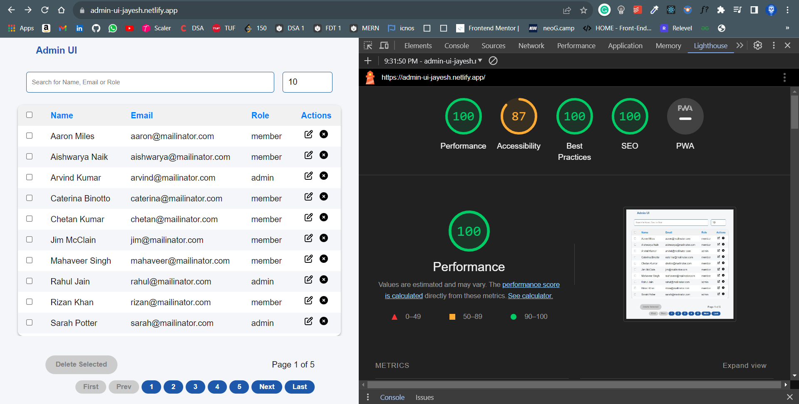
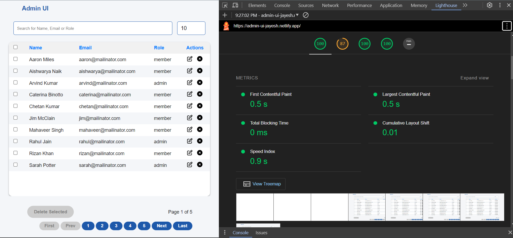

# Geektrust Challenge

This project was created using vite

To install and run the app locally, follow these steps:

1. Clone the repository.
2. Install dependencies using `npm install`.
3. Run the development server with `npm run dev`.

## Available Scripts

In the project directory, you can run:

### `npm run dev`

Runs the app in the development mode.\
Open [http://localhost:3000](http://localhost:3000) to view it in your browser.

### `npm run build`

Builds the app for production to the `build` folder.\
It correctly bundles React in production mode and optimizes the build for the best performance.

The build is minified and the filenames include the hashes.\
Your app is ready to be deployed!

### Deployment

project is deployed using netlify : [Your Link Text](https://admin-ui-jayesh.netlify.app/)

